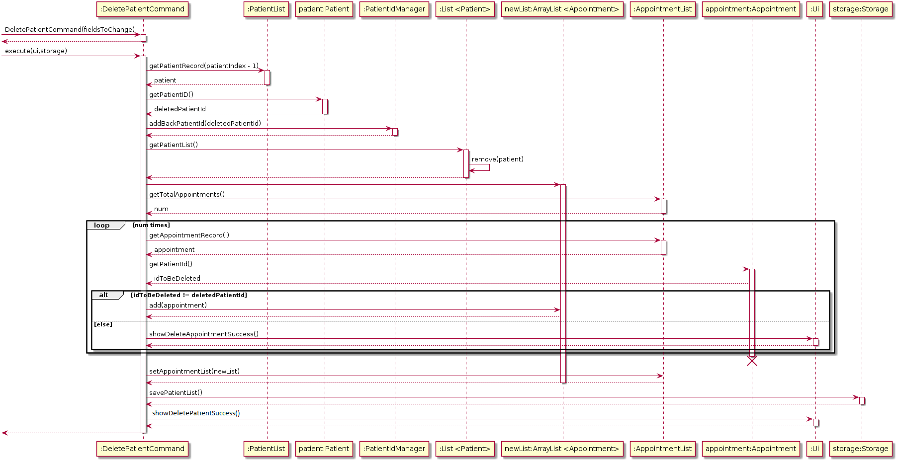
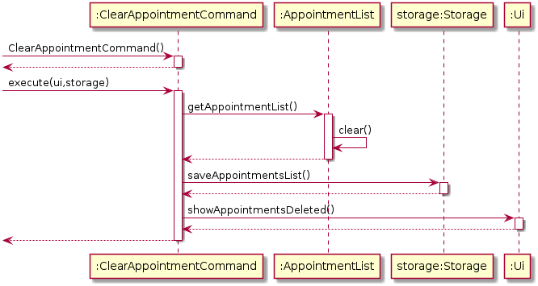
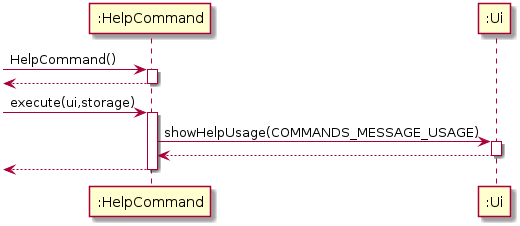

# Nguyen Thanh Duc - Project Portfolio Page

## PROJECT: Hospital Administrative Management System v2.0

---

## Overview

Hospital Administrative Management System - HAMS is a CLI-based medical facility administration system that assists in the maintenance of various medical records. 

HAMS is designed for administrative assistants in medical facilities, like hospitals or polyclinics, that *prefer using
CLI to keep track of various medical records* and *can type fast*.

### Summary of Contributions

* *Major enhancement 1*: added *the edit, delete, clear commands for patients and appointments* and *help usage and bye message for users*
    * What it does: 
        
        Noted that all features mentioned below will be available for both patient and appointment list
        * Edit feature: allows the users to edit some information in the lists or update them when some field in the form has not been added at first
        * Delete feature: allows the users to delete a patient/appointment given the index of that patient/appointment. A noted point here is that appointments related to a patient which has been deleted will also be deleted
        * Clear feature: allows the users to clear all the items in either appointment list, patient list or even both of them. Noted that once patient list is cleared, appointment list is cleared also.
        * Help usage: help the users to see a list of valid commands with given examples and usage
        * Bye message: Basically when users type `bye`, the program will be terminated
    * Justification: 
        * Edit feature: Patient's information can sometimes be wrongly inputted by the admins or some information are not provided at that moment and can be updated later on. For example, a patient forgot his phone number and he/she can inform the admins so that they can update later on.
        * Delete feature: Once a patient has finished his treatment in the hospital or clinic, his information needs to be deleted to make spaces to store the records for other patients. Also, once an appointment of a patient is finished, it cam also be deleted.
        * Clear feature: A better way for admins to delete all the patients when the clinic or hospital is no longer available.
        * Help usage: Sometimes, users can be too lazy to read the User Guide or they cannot clearly understand about the User Guide. In this case, the help command is a good way for users to start learn about the program and get used to it.
        * Bye message: There must be a way for users to terminate a program properly without brute-forcing. Imagine the program run forever and how it takes place of the usage in your PC or laptop.
    * Highlights: These are some basic enhancements to a program resembled to some apps to keep track of to-to task like ToDoList app or our most recent individual project in CS2113. However, the exceptions handling is the hardest part in this implementation and I have learned how to test properly from implementing these features.
    * Credits: Some of the code and diagrams are inspired from these repos on GitHub: [AddressBook-Level2](https://github.com/se-edu/addressbook-level2), [AddressBook-Level3](https://github.com/se-edu/addressbook-level3)
    
* *Major enhancement 2*: added *validation for fields in patient*
    * What it does: This enhancement is to inform users of the correct format of the information they can input.
    * Justification: For example, when you try to edit or add a phone number for a patient. It cannot contain over 20 digits or character inside it. Therefore, we have make a strict restriction when users try to type in the information of the fields. 
    In HAMS, I will restrict name and addresses to 64 characters (including of whitespaces), phone number can only contain 8 digits and age is bounded from 0 to 150.
    * Highlights: This enhancement is implemented after the mock PE in the CS2113 lectures and we have received several issues related to our characters or number limit for certain fields
    * Credits: This part is taken inspiration from data format validation in [AddressBook-Level2](https://github.com/se-edu/addressbook-level2/tree/master/src/seedu/addressbook/data/person)
    
* *Minor enhancement*: Add set methods in Patient class to handle with the editing and updating of commands, add some exceptions to handle with corner test cases, bugs, and format validation, and I have to handle it with a lot of testing.

* *Code contributed*: [My commit](https://nus-cs2113-ay1920s2.github.io/tp-dashboard/#breakdown=true&search=thanhduc2000&sort=groupTitle&sortWithin=title&since=2020-03-01&timeframe=commit&mergegroup=false&groupSelect=groupByRepos)

* *Contributions to the documentation*: Create a scratch for the User Guide (v1.0 of our product) and add some Q&A questions to the guide.

* *Contributions to the Developer Guide*: As I have to implement the two enhancements mentioned earlier. I have to write some DG sub-sections to explain about my implementation and the design consideration. Also, I have added multiple sequence diagrams for better explanation.

* *Contributions to team-based tasks*: Some example of my suggestions and replying for the project's enhancement: 
    * Issues fixing: [#49](https://github.com/AY1920S2-CS2113T-T13-3/tp/issues/49), [#51](https://github.com/AY1920S2-CS2113T-T13-3/tp/issues/51), [#70](https://github.com/AY1920S2-CS2113T-T13-3/tp/issues/70)
    * PRs reviewed: [#10](https://github.com/AY1920S2-CS2113T-T13-3/tp/pull/10)
    
* *Contributions to community*:
    * DG reviewed: [[CS2113T-T12-4] PAC](https://github.com/nus-cs2113-AY1920S2/tp/pull/14/files/7b341f6ff9cc4b8d6c6c5e04df7b1509c8399f82)
    * Bugs finding for a random team: [PE-D](https://github.com/thanhduc2000/ped/issues)

### Contributions to the User Guide

> Given below are sections I contributed to the User Guide. They showcase my ability to write documentation targeting end-users.


## 6. FAQ

**Q**: Why when I try to delete a patient in the list, some appointments are being deleted also?

**A**: Because once you delete a patient, all the appointments related to him/her (through an attribute called ```pid```) are deleted also. Only when there are no appointments
related to the patients, they are not deleted.

**Q**: Why when I try to clear all the patients in the patient list, the appointments are cleared also?

**A**: The reason is that there is a dependency of appointments on patients. Each patient can be assigned to multiple appointments through ```pid```. Like mentioned in the previous
question, you can realize that once we clear all the patients, the presence of such appointments are no longer valid (All appointments belong to all patients). Hence, they are cleared
also.

### Contributions to the Developer Guide

> Given below are sections I contributed to the Developer Guide. They showcase my ability to write technical documentation and the technical depth of my contributions to the project.

#### 2.2.4.7 EditAppointmentClass

To edit an appointment, the ```EditAppointmentCommand``` class is used. For this ```EditAppointmentCommand``` class, it 
serves as a facade class for the ```Main```, ```Appointment```, ```AppointmentList```, ```Ui``` and the ```Storage``` class to 
interact with one another. 

1. The ```EditAppointmentCommand``` class is processed by ```Parser```

2. When 
the ```Main``` calls ```execute(Ui ui, Storage storage)```, the ```EditAppointmentCommand``` class would call upon the 
```Appointment``` class to make an ```Appointment``` Object. 

3. After which, the ```EditAppoinmentCommand``` object will  call upon the ```AppointmentList``` object to get the record 
of the record of the appointment based on the index with ```getAppointmentRecord``` .

4. After that, ```EditAppoinmentCommand``` will  call the ```setAppointmentInfo``` method from ```Patient`` to update the
appointment.

5. The ```AppointmentList``` will be updated with the newly updated appointment.

6. Finally, it will call upon the ```Storage``` class’s ```saveAppoinmentList()``` function to save the updated appointment list. 

7. Upon successfully editing the 
```Appointment``` object into the appointment list, it will call upon the ```Ui``` class’ 
```showUpdateAppointmentSuccess()``` function to display the success of adding the ```appointment``` in the appointment 
list.

Below shows the sequence diagram for ```EditAppointmentCommand``` class.


#### 2.2.4.8 EditPatientCommand CLass

To edit an appointment, the ```EditPatientCommand``` class is used. For this ```EditPatientCommand``` class, it 
serves as a facade class for the ```Main```, ```Patient```, ```PatientList```, ```Ui``` and the ```Storage``` class to 
interact with one another. 

1. The ```EditPatientCommand``` class is processed by ```Parser```

2. When 
the ```Main``` calls ```execute(Ui ui, Storage storage)```, the ```EditPatientCommand``` class would call upon the 
```Patient``` class to make a ```Patient``` Object. 

3. After which, the ```EditPatientCommand``` object will  call upon the ```PatientList``` object to get the record 
of the record of the patient based on the index with ```getPatientRecord``` .

4. After that, ```EditPatientCommand``` will  call the ```setPatientInfo``` method from ```Patient`` to update the
patient.

5. The ```AppointmentList``` will be updated with the newly updated patient.

6. Finally, it will call upon the ```Storage``` class’s ```savePatienttList()``` function to save the updated patient list. 

7. Upon successfully editing the 
```Patient``` object into the appointment list, it will call upon the ```Ui``` class’ 
```showUpdatePatientSuccess()``` function to display the success of adding the ```patient``` in the appointment 
list.

Below shows the sequence diagram for ```EditPatientCommand``` class.


#### 2.2.4.9 DeleteAppointmentCommand Class

To delete an appointment, the ```DeleteAppointmentCommand``` class is used. For this ```DeleteAppointmentCommand``` class, it 
serves as a facade class for the ```Main```, ```Appointment```, ```AppointmentList```, ```Ui``` and the ```Storage``` class to 
interact with one another. 

1. The ```DeleteAppointmentCommand``` class is processed by ```Parser```

2. When the ```Main``` calls ```execute(Ui ui, Storage storage)```, the ```DeleteAppointmentCommand``` class would call upon the 
```Appointment``` class to make an ```Appointment``` Object. 

3. After which, the ```DeleteAppoinmentCommand``` object will  call upon the ```AppointmentList``` object to get the appointment
list with ```getAppointmentList()``` and remove the appointment record with given index from ```getAppointmentRecord()```

4. Finally, it will call upon the ```Storage``` class’s ```saveAppoinmentList()``` function to save the updated appointment list. 

5. Upon successfully deleting the 
```Appointment``` object into the appointment list, it will call upon the ```Ui``` class’ 
```showDeleteAppointmentSuccess()``` function to display the success of deleting the ```appointment```from the appointment 
list.

Below shows the sequence diagram for ```DeleteAppointmentCommand``` class.


#### 2.2.4.10 DeletePatientCommand Class

To delete an appointment, the ```DeletePatientCommand``` class is used. For this ```DeletePatientCommand``` class, it 
serves as a facade class for the ```Main```, ```Appointment```, ```AppointmentList```, ```Ui``` and the ```Storage``` class to 
interact with one another. 

1. The ```DeletePatientCommand``` class is processed by ```Parser```

2. When the ```Main``` calls ```execute(Ui ui, Storage storage)```, the ```DeletePatientCommand``` class would call upon the 
```Patient``` class to make a ```Patient``` Object. 

3. After which, the ```DeletePatientCommand``` object will  call upon the ```PatientList``` object to get the patient
list with ```getPatientList()``` and remove the patient record with given index from ```getPatientRecord()```

4. Then it will go through all the items in ```AppointmentList``` with the patientId of the patient that has been deleted

4. Finally, it will call upon the ```Storage``` class’s ```savePatientList()``` function to save the updated patient list. 

5. Upon successfully deleting the ```Patient``` object from the patient list, it will call upon the ```Ui``` class’ 
```showDeletePatientSuccess()``` function to display the success of deleting the ```patient```from the patient 
list.

Below shows the sequence diagram for ```DeletePatientCommand``` class.



#### 2.2.4.11 ClearAllCommand Class

To clear both appointment list and patient list, the ```ClearAllCommand``` class is used. For this ```ClearAllCommand``` class, it 
serves as a facade class for the ```Main```, ```PatientList```, ```AppointmentList```, ```Ui``` and the ```Storage``` class to 
interact with one another. 

1. The ```ClearAllCommand``` class is processed by ```Parser```

2. When the ```Main``` calls ```execute(Ui ui, Storage storage)```, the ```ClearAllCommand``` class would call upon the 
```PatientList``` and ```AppointmentList``` to clear all the items in both lists

3. It will call upon the ```Storage``` class’s ```savePatientList()``` and ```saveAppointmentList()```function 
to save the updated patient list and appointment list.

4. Upon successfully clearing all the lists, it will call upon the ```Ui``` class’ ```showAllItemsDeleted()``` function 
to display the success of clearing all the items.

Below shows the sequence diagram for ```ClearAllCommand``` class.


#### 2.2.4.12 ClearAppointmentCommand Class

To clear appointment list, the ```ClearAppointmentCommand``` class is used. For this ```ClearAppointmentCommand``` class, it 
serves as a facade class for the ```Main```, ```AppointmentList```, ```Ui``` and the ```Storage``` class to 
interact with one another. 

1. The ```ClearAppointmentCommand``` class is processed by ```Parser```

2. When the ```Main``` calls ```execute(Ui ui, Storage storage)```, the ```ClearAppointmentCommand``` class would call upon the 
```AppointmentList``` to clear the items in appointment list.

3. It will call upon the ```Storage``` class’s ```saveAppointmentList()```function to save the updated appointment list.

4. Upon successfully clearing the list, it will call upon the ```Ui``` class’ ```showAppointmentsDeleted()``` function 
to display the success of clearing all the items in appointment list.

Below shows the sequence diagram for ```ClearAppointmentCommand``` class.



#### 2.2.4.13 ClearPatientCommand Class

To clear patient list, the ```ClearPatientCommand``` class is used. For this ```ClearPatientCommand``` class, it 
serves as a facade class for the ```Main```, ```PatientList```, ```Ui``` and the ```Storage``` class to 
interact with one another. 

1. The ```ClearPatientCommand``` class is processed by ```Parser```

2. When the ```Main``` calls ```execute(Ui ui, Storage storage)```, the ```ClearPatientCommand``` class would call upon the 
```PatientList``` to clear the items in patient list.

3. It will call upon the ```Storage``` class’s ```savePatientList()```function to save the updated patient list.

4. Upon successfully clearing the list, it will call upon the ```Ui``` class’ ```showPatientsDeleted()``` function 
to display the success of clearing all the items in patient list.

Below shows the sequence diagram for ```ClearPatientCommand``` class.


#### 2.2.4.14 HelpCommand

To see the help usage for the commands in HAMS, the ```HelpCommand``` class is used. For this ```HelpCommand``` class, it 
serves as a facade class for the ```Main```, ```Ui``` class to interact. The purpose of the class is to print out the usage
for all the commands in HAMS through ```showHelpUsage()``` in ```Ui```.

Below shows the sequence diagram for ```HelpCommand``` class.


 
#### 2.2.4.15 ExitCommand
 
To print the bye message for HAMS, the ```HelpCommand``` class is used. For this ```ClearPatientCommand``` class, it 
serves as a facade class for the ```Main```, ```Ui``` class to interact.

1. The ```Main``` class will check whether ```isExit()``` is set to be true or not.

2. ```Ui``` class' ```showByeMessage()``` method is used to print the bye message for users.
 
Below shows the sequence diagram for ```ExitCommand``` class.


